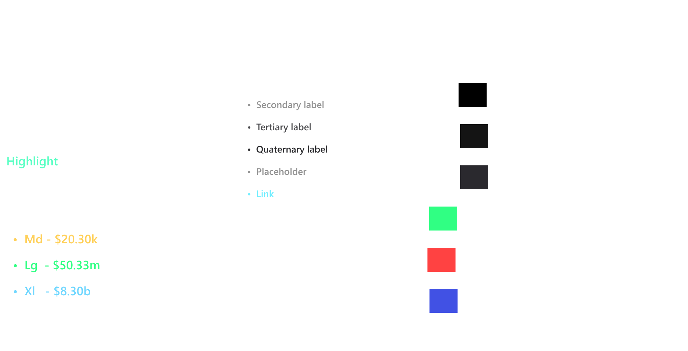

# Mythic

Mythic is a native blockchain navigator.

## Build & Run Locally

```bash
cargo run ui
```

## Building the Windows .msi installer

We use `cargo-wix` to build Windows installers so Mythic can be installed on Windows.

1. Create the wix file that is used to build the installer: `cargo wix init --package mythic --force`
2. Run wix: `cargo wix --package mythic --nocapture --name Mythic`. The name flag will make this the application name saved in Program Files.
3. Run the installer with the `--install` flag.

## Building the MacOS .dmg installer

We use `cargo-bundle` to build MacOS and Linux bundles, but have not tested Mythic on Linux.

1. Run `cargo bundle --target {target}`. target should match rust compiler targets.

## UI

Mythic uses its own component library for the UI elements.




## Disclaimer
> Mythic is provided "as is", without warranty of any kind, express or implied, including but not limited to the warranties of merchantability, fitness for a particular purpose and noninfringement. In no event shall the authors or copyright holders be liable for any claim, damages or other liability, whether in an action of contract, tort or otherwise, arising from, out of or in connection with the software or the use or other dealings in the software.