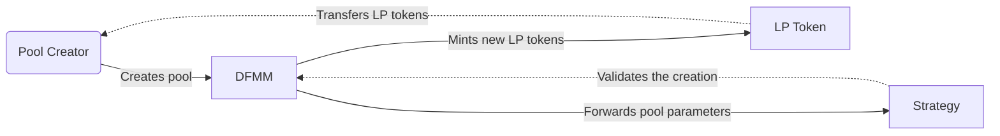
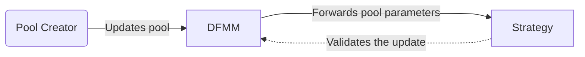
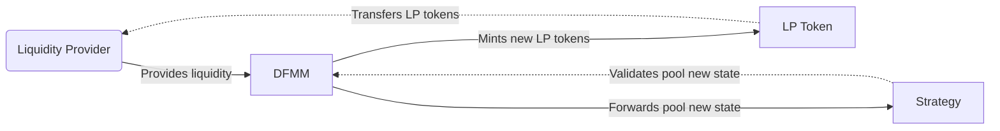

# DFMM

## Overview

## Repository Structure

## Contracts Architecture

### Initializing and updating a pool

#### Creating a new pool



#### Updating a pool



### Providing liquidity

#### Allocating



### Arbitrage

## Deployments

| Designation | Network | Address |
|---|---|---|
| `DFMM` | Optimism Sepolia | `0xedfC913a848A8a1567CfA8a81158118c20D3D508` |
| `G3M` | Optimism Sepolia | `0x8fF9a56BCbcB768A84AEc0eA879C38C1fDBE6f4A` |
| `LogNormal` | Optimism Sepolia | `0xb7a21C0DEDEa8c8525001D8189DE0a5479E9566a` |

You can deploy the contracts with the following command:

```bash
$ forge script ./src/script/Deployment.s.sol --rpc-url $OPTIMISM_SEPOLIA_RPC_URL --broadcast --verify -vvv
```

*Note: Be sure to populate your `.env` file with the required environment variables beforehand.*

## Licences
