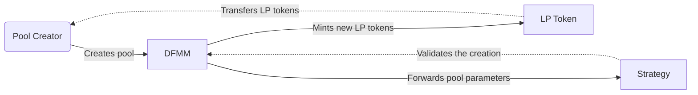
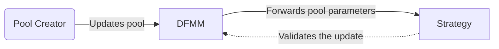
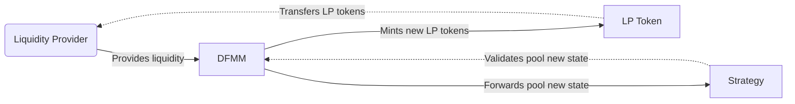

# DFMM

## Overview

## Repository Structure

```
src/
 ├─DFMM.sol
 ├─...
 ├─interfaces/
 │  ├─IDFMM.sol
 │  └─...
 ├─lib/
 │  ├─ScalingLib.sol
 │  └─...
 ├─script/
 │  ├─Deployment.s.sol
 │  └─...
 ├─solvers/
 │  └─G3M/
 │     ├─G3MSolver.sol
 │     └─...
 ├─strategies/
 │  └─G3M/
 │     ├─G3MStrategy.sol
 │     └─...
 └─test/
    ├─attack/
    ├─fork/
    ├─invariant/
    ├─unit/
    └─...
```

## Contracts Architecture

### Initializing and updating a pool

#### Creating a new pool



#### Updating a pool



### Providing liquidity

#### Allocating



### Arbitrage

## Deployments

| Designation | Network | Address |
|---|---|---|
| `DFMM` | Optimism Sepolia | `0x89a023e3cbccf1c96F00749F87D24C9B1124BaE1` |
| `G3M` | Optimism Sepolia | `0xB5C2c5a4000FB230b289bB54f8b48F4dd8075F3D` |
| `LogNormal` | Optimism Sepolia | `0x6A74a571c638dDDF13ae52F48A37D1019B916520` |

You can deploy the contracts with the following command:

```bash
$ forge script ./src/script/Deployment.s.sol --rpc-url $OPTIMISM_SEPOLIA_RPC_URL --broadcast --verify -vvv
```

*Note: Be sure to populate your `.env` file with the required environment variables beforehand.*

## Licences
